# 🛒 Lista Compra - Android App

**Plataforma:** Android Nativo (Kotlin)  
**Arquitectura:** Clean Architecture + MVVM  
**Almacenamiento:** Room Database (local) + Export JSON  
**Usuario:** Jose (Xoce)  
**Última actualización:** 2026-04-01

---

## 📱 Capturas de Pantalla

### Pantalla Principal (Home)

| Home | 
|------|
| 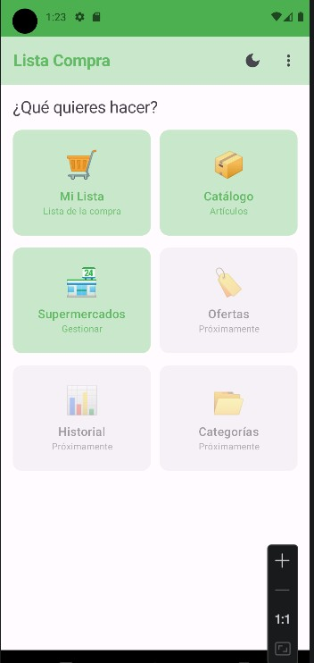 |

Navegación rápida a las diferentes secciones de la app.

---

### Lista de la Compra

| Lista Principal | Añadir Producto | Productos en Lista |
|-----------------|-----------------|-------------------|
| 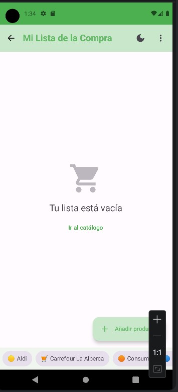 | 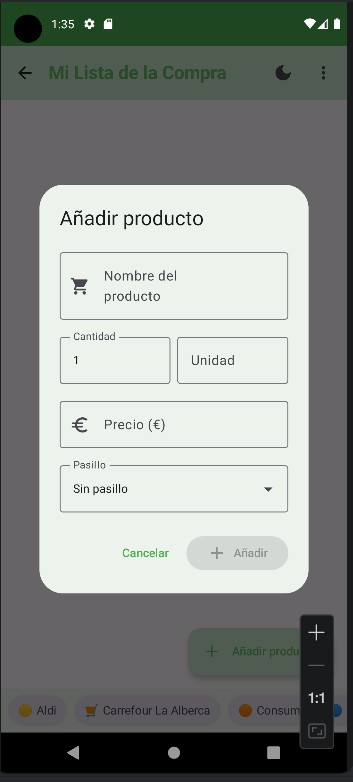 | 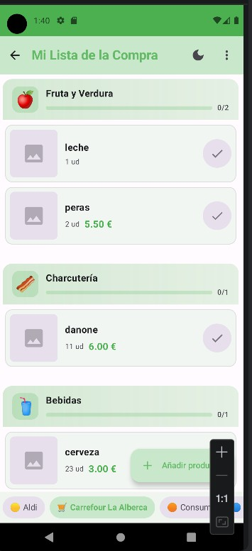 |

**Funcionalidades:**
- Productos agrupados por pasillo
- Toggle comprado/no comprado
- Edición inline de productos
- Totales actualizados en tiempo real
- Selector de supermercado en la barra inferior

---

### Catálogo de Artículos

| Catálogo | Añadir Artículo | Detalle | Editar |
|----------|-----------------|---------|--------|
| 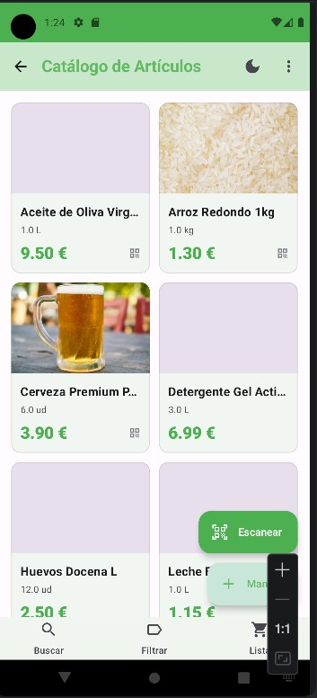 | 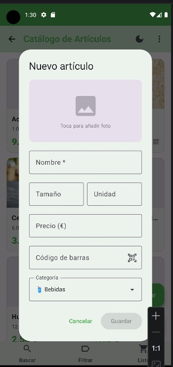 | 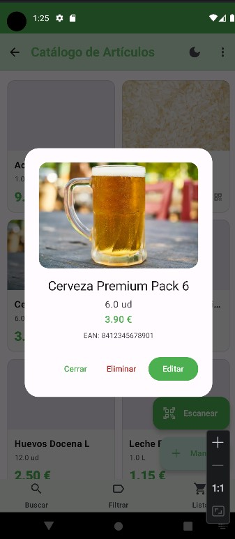 | 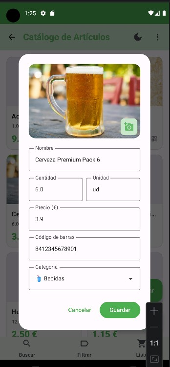 |

| Scanner EAN |
|-------------|
| 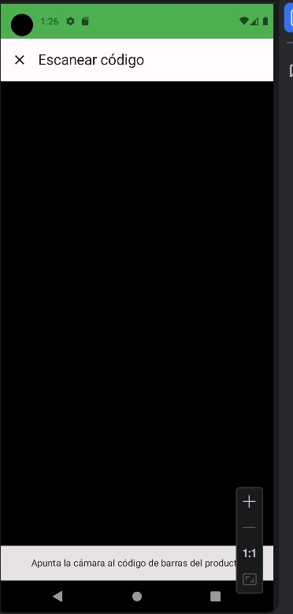 |

**Funcionalidades:**
- Catálogo personal de artículos
- Imagen desde cámara/galería
- Scanner de códigos de barras (OpenFoodFacts)
- Organización por categorías
- Historial de precios

---

### Gestión de Supermercados

| Lista Supermercados | Añadir | Detalle | Editar | Editar Pasillo |
|--------------------|-------|---------|--------|----------------|
| 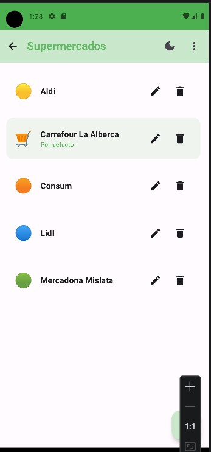 | 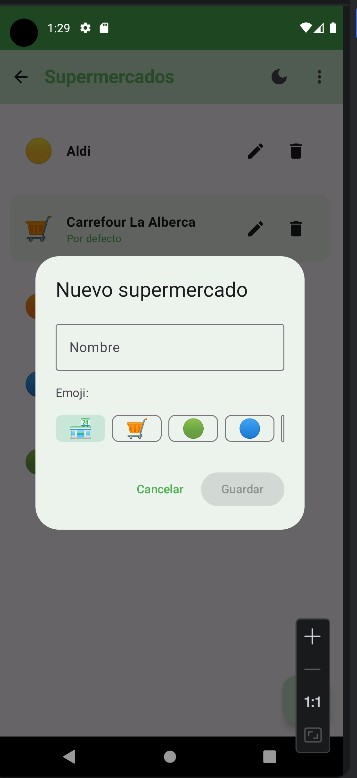 | 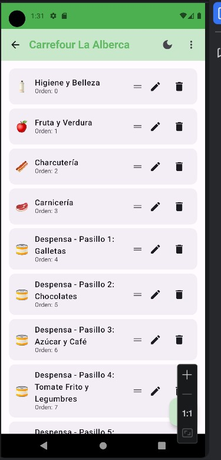 | 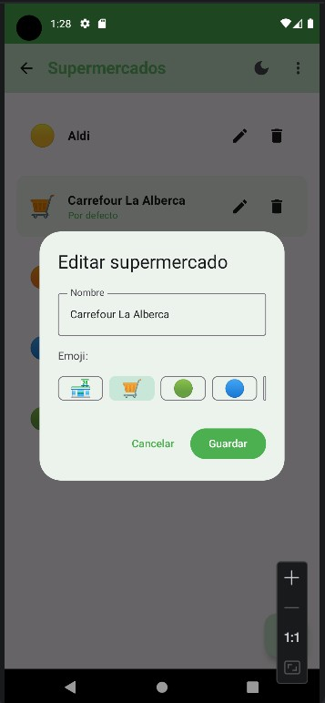 | 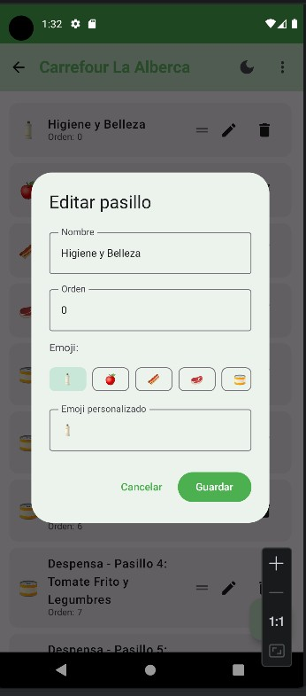 |

**Funcionalidades:**
- Múltiples supermercados con pasillos específicos
- Carrefour con 19 pasillos preconfigurados
- Pasillos genéricos para otros supermercados
- Orden personalizado de pasillos

---

## ✅ Características Implementadas

### Funcionalidades Core
- ✅ Lista de productos organizada por pasillos
- ✅ Múltiples supermercados con pasillos específicos
- ✅ Catálogo de artículos con imágenes
- ✅ Scanner de códigos de barras (OpenFoodFacts)
- ✅ Sugerencias de nombre y pasillo al añadir
- ✅ Marcar como comprado con animación
- ✅ Calcular total estimado
- ✅ Tema oscuro/claro
- ✅ Colores personalizables
- ✅ Exportar/Importar JSON
- ✅ Splash screen animado
- ✅ Feedback táctil (vibración)

### Gestión de Datos
- ✅ Base de datos local (Room)
- ✅ Sincronización offline-first
- ✅ Precarga de datos iniciales
- ✅ Migración automática de esquema

### UI/UX
- ✅ Material Design 3
- ✅ Jetpack Compose
- ✅ Navegación fluida
- ✅ Cards informativas
- ✅ Indicadores visuales de ofertas

---

## 🚀 Compilar y Ejecutar

### Requisitos
- Android Studio Hedgehog (2023.1.1) o superior
- JDK 19
- Android SDK 34
- Kotlin 1.9+

### Pasos

```bash
# Clonar
git clone https://github.com/joserodriguezballester/lista-compra-app.git
cd lista-compra-app

# Compilar
./gradlew build

# Instalar (debug con .dev)
./gradlew installDebug
```

**Nota:** La versión debug usa `applicationIdSuffix = ".dev"` → `com.jose.listacompra.dev`

---

## 🏗️ Arquitectura

```
Clean Architecture + MVVM
│
├── presentation/          # UI Layer (Compose)
│   ├── screens/
│   ├── components/
│   └── viewmodel/
│
├── domain/                # Business Logic
│   ├── model/
│   ├── repository/        # Interfaces (I*Repository)
│   └── usecase/
│
└── data/                  # Data Layer
    ├── local/
    │   ├── entities/
    │   ├── dao/
    │   └── Database.kt
    ├── remote/
    └── repository/        # Implementations (*RepositoryImpl)
```

### Convenciones
| Tipo | Nombre | Ejemplo |
|------|--------|---------|
| Interfaz repositorio | `I{Nombre}Repository` | `IProductRepository` |
| Implementación | `{Nombre}RepositoryImpl` | `ProductRepositoryImpl` |
| UseCase | `{Verbo}{Sujeto}UseCase` | `GetAllProductsUseCase` |

---

## 📦 Tech Stack

| Componente | Tecnología |
|------------|------------|
| Lenguaje | Kotlin 1.9+ |
| UI | Jetpack Compose + Material 3 |
| Database | Room 2.6.1 |
| DI | Hilt |
| Navigation | Compose Navigation |
| Images | Coil |
| Barcode | ML Kit + CameraX |
| API | Retrofit + OpenFoodFacts |
| Build | Gradle 8.2 (KTS) |

---

## 📁 Estructura del Proyecto

```
app/src/main/java/com/jose/listacompra/
├── ListaCompraApplication.kt
│
├── data/
│   ├── initializer/          # DatabaseSeedInitializer
│   ├── local/
│   │   ├── Database.kt
│   │   ├── dao/
│   │   └── entities/
│   ├── remote/
│   │   └── OpenFoodFactsApi.kt
│   └── repository/
│
├── domain/
│   ├── model/
│   │   ├── Product.kt
│   │   ├── Aisle.kt
│   │   ├── Supermarket.kt
│   │   └── Category.kt
│   ├── repository/
│   └── usecase/
│
├── di/
│   ├── DatabaseModule.kt
│   └── PreferencesModule.kt
│
└── ui/
    ├── components/
    ├── screens/
    ├── navigation/
    ├── theme/
    └── viewmodel/
```

---

## 🎯 Roadmap

### Próximas mejoras
- [ ] Añadir productos por voz
- [ ] Historial de compras con estadísticas
- [ ] Importar lista desde texto
- [ ] Sincronización en la nube (Supabase)
- [ ] Compartir listas entre familiares
- [ ] Widget para pantalla de inicio
- [ ] Notificaciones push

---

## 📄 Licencia

Privado - Uso personal

---

*Desarrollado para Jose (Xoce) - Mislata, Valencia*
