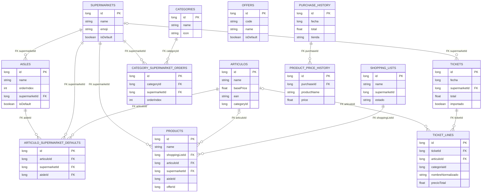
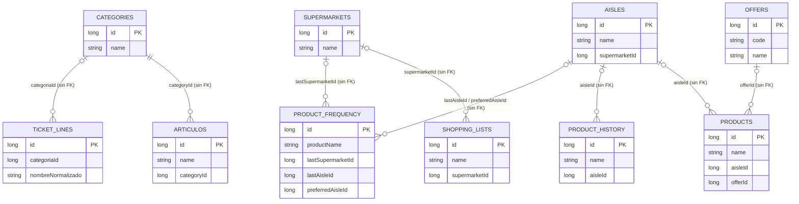

# Diagrama entidad-relación de `lista-compra-app`

Diagrama basado en las `Entity` reales de Room (`Database.kt` + `entities/*.kt`).

## 1. Relaciones con FK reales en Room

## 2. Relaciones lógicas relevantes (sin FK real en Room)

## 3. Nota rápida

- El primer diagrama recoge solo relaciones **forzadas por Room/FK**.
- El segundo recoge relaciones **lógicas usadas por la app**, pero que Room **no protege** con FK.
- Hay tablas históricas (`product_history`, `product_frequency` y parte de `product_price_history`) que además se apoyan bastante en nombres normalizados, no solo en IDs.
