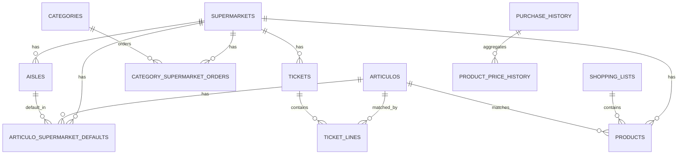

# Modelo de base de datos / entidad-relación

**Proyecto:** `lista-compra-app`  
**BD Room:** `shopping_list_db`  
**Versión actual:** `14`

Este documento resume la estructura real de la BD a partir de `Database.kt` y de las `Entity` actuales.

---

## 1. Vista rápida por bloques

### Datos base / configuración
- `supermarkets`
- `categories`
- `offers`
- `aisles`

### Datos operativos del usuario
- `articulos`
- `shopping_lists`
- `products`
- `articulo_supermarket_defaults`
- `category_supermarket_orders`

### Historial / sugerencias
- `purchase_history`
- `product_price_history`
- `product_frequency`
- `product_history`

### Importación de tickets
- `tickets`
- `ticket_lines`

---

## 2. Diagrama ER resumido

> **Importante:** el diagrama muestra sobre todo relaciones **forzadas por FK**. Más abajo se detallan también las relaciones **lógicas** que existen en código pero no están blindadas por Room.

---

## 3. Entidades y propósito

### `supermarkets`
**Entidad:** `SupermarketEntity`  
Campos:
- `id`
- `name`
- `emoji`
- `isDefault`

Uso:
- catálogo de supermercados
- soporta supermercados base y custom del usuario

---

### `categories`
**Entidad:** `CategoryEntity`  
Campos:
- `id`
- `name`
- `icon`

Uso:
- categorías de artículos
- también soporta categorías editables por usuario

---

### `offers`
**Entidad:** `OfferEntity`  
Campos:
- `id`
- `code`
- `name`
- `description`
- `isDefault`
- `formula`

Uso:
- promociones/ofertas
- `isDefault=false` indica oferta custom del usuario

---

### `aisles`
**Entidad:** `AisleEntity`  
Campos:
- `id`
- `name`
- `emoji`
- `orderIndex`
- `supermarketId`
- `isDefault`

Uso:
- pasillos por supermercado
- mezcla pasillos base y pasillos custom

**FK real:**
- `supermarketId -> supermarkets.id` (`CASCADE`)

---

### `articulos`
**Entidad:** `ArticuloEntity`  
Campos:
- `id`
- `name`
- `basePrice`
- `photoUri`
- `ean`
- `categoryId`
- `size`
- `unit`

Uso:
- catálogo real del usuario

**Relación lógica (sin FK real):**
- `categoryId -> categories.id`

---

### `shopping_lists`
**Entidad:** `ShoppingListEntity`  
Campos:
- `id`
- `name`
- `supermarketId`
- `fechaCreacion`
- `estado`

Uso:
- listas activas y archivadas

**Relación lógica (sin FK real):**
- `supermarketId -> supermarkets.id`

---

### `products`
**Entidad:** `ProductEntity`  
Campos:
- `id`
- `name`
- `aisleId`
- `shoppingListId`
- `articuloId`
- `supermarketId`
- `quantity`
- `estimatedPrice`
- `offerId`
- `finalPrice`
- `isPurchased`
- `notes`
- `orderIndex`
- `photoUri`
- `ean`

Uso:
- productos concretos dentro de una lista

**FK reales:**
- `shoppingListId -> shopping_lists.id` (`CASCADE`)
- `articuloId -> articulos.id` (`SET_NULL`)
- `supermarketId -> supermarkets.id` (`CASCADE`)

**Relaciones lógicas (sin FK real):**
- `aisleId -> aisles.id`
- `offerId -> offers.id`

---

### `articulo_supermarket_defaults`
**Entidad:** `ArticuloSupermarketDefaultEntity`  
Campos:
- `id`
- `articuloId`
- `supermarketId`
- `aisleId`

Uso:
- pasillo por defecto de un artículo en un supermercado concreto

**FK reales:**
- `articuloId -> articulos.id` (`CASCADE`)
- `supermarketId -> supermarkets.id` (`CASCADE`)
- `aisleId -> aisles.id` (`CASCADE`)

**Restricción útil:**
- único por `(articuloId, supermarketId)`

---

### `category_supermarket_orders`
**Entidad:** `CategorySupermarketOrderEntity`  
Campos:
- `id`
- `categoryId`
- `supermarketId`
- `orderIndex`

Uso:
- orden de categorías por supermercado

**FK reales:**
- `categoryId -> categories.id` (`CASCADE`)
- `supermarketId -> supermarkets.id` (`CASCADE`)

**Restricción útil:**
- único por `(categoryId, supermarketId)`

---

### `purchase_history`
**Entidad:** `PurchaseHistoryEntity`  
Campos:
- `id`
- `fecha`
- `total`
- `tienda`
- `numProductos`
- `ahorroTotal`
- `ticketUrl`

Uso:
- resumen global de compras
- `ticketUrl` apunta a una ruta local si existe el PDF

---

### `product_price_history`
**Entidad:** `ProductPriceHistoryEntity`  
Campos:
- `id`
- `purchaseId`
- `productName`
- `price`
- `quantity`
- `aisle`
- `fecha`

Uso:
- histórico de precios por producto

**FK real:**
- `purchaseId -> purchase_history.id` (`CASCADE`)

---

### `product_frequency`
**Entidad:** `ProductFrequencyEntity`  
Campos:
- `id`
- `productName`
- `originalName`
- `timesPurchased`
- `lastPurchaseDate`
- `averageDaysBetween`
- `estimatedNextDate`
- `category`
- `lastAisleId`
- `lastQuantity`
- `lastPrice`
- `lastSupermarketId`
- `preferredAisleId`

Uso:
- sugerencias de recompra / frecuencia

**Relaciones lógicas (sin FK real):**
- `lastAisleId -> aisles.id`
- `preferredAisleId -> aisles.id`
- `lastSupermarketId -> supermarkets.id`

---

### `product_history`
**Entidad:** `ProductHistoryEntity`  
Campos:
- `id`
- `name`
- `originalName`
- `aisleId`
- `lastQuantity`
- `lastPrice`
- `usageCount`
- `lastUsed`

Uso:
- autocompletado / productos frecuentes

**Relación lógica (sin FK real):**
- `aisleId -> aisles.id`

---

### `tickets`
**Entidad:** `TicketEntity`  
Campos:
- `id`
- `fecha`
- `supermarketId`
- `supermarketName`
- `total`
- `subtotal`
- `descuentos`
- `numProductos`
- `socioClub`
- `formaPago`
- `pdfPath`
- `importado`
- `createdAt`

Uso:
- ticket raw importado desde PDF/imagen

**FK real:**
- `supermarketId -> supermarkets.id` (`SET_NULL`)

---

### `ticket_lines`
**Entidad:** `TicketLineEntity`  
Campos:
- `id`
- `ticketId`
- `nombreOriginal`
- `nombreNormalizado`
- `cantidad`
- `precioUnitario`
- `precioTotal`
- `articuloId`
- `categoriaId`
- `esDescuento`
- `codigoPromocion`
- `notas`
- `confirmado`

Uso:
- líneas de producto de un ticket

**FK reales:**
- `ticketId -> tickets.id` (`CASCADE`)
- `articuloId -> articulos.id` (`SET_NULL`)

**Relación lógica (sin FK real):**
- `categoriaId -> categories.id`

---

## 4. Relaciones reales vs relaciones lógicas

### Relaciones forzadas por Room/FK
- `products.shoppingListId -> shopping_lists.id`
- `products.articuloId -> articulos.id`
- `products.supermarketId -> supermarkets.id`
- `aisles.supermarketId -> supermarkets.id`
- `articulo_supermarket_defaults.articuloId -> articulos.id`
- `articulo_supermarket_defaults.supermarketId -> supermarkets.id`
- `articulo_supermarket_defaults.aisleId -> aisles.id`
- `category_supermarket_orders.categoryId -> categories.id`
- `category_supermarket_orders.supermarketId -> supermarkets.id`
- `product_price_history.purchaseId -> purchase_history.id`
- `tickets.supermarketId -> supermarkets.id`
- `ticket_lines.ticketId -> tickets.id`
- `ticket_lines.articuloId -> articulos.id`

### Relaciones usadas en lógica pero NO protegidas por FK
- `articulos.categoryId -> categories.id`
- `shopping_lists.supermarketId -> supermarkets.id`
- `products.aisleId -> aisles.id`
- `products.offerId -> offers.id`
- `ticket_lines.categoriaId -> categories.id`
- `product_history.aisleId -> aisles.id`
- `product_frequency.lastAisleId -> aisles.id`
- `product_frequency.preferredAisleId -> aisles.id`
- `product_frequency.lastSupermarketId -> supermarkets.id`

Esto es importante para:
- migraciones
- import/export de datos
- limpieza de datos
- evitar inconsistencias silenciosas

---

## 5. Flujo relevante: ticket -> histórico

En el flujo actual de `SaveTicketUseCase`:

1. se guarda el ticket raw en `tickets`
2. se guardan las líneas en `ticket_lines`
3. se crea una compra resumida en `purchase_history`
4. para las líneas matcheadas se genera `product_price_history`
5. se actualiza `product_frequency`

Consecuencia práctica:
- un ticket importado puede vivir como **ticket raw**
- y además alimentar el **histórico derivado**

Eso explica por qué, al diseñar backups/importaciones, conviene decidir conscientemente si preservar:
- solo el efecto histórico
- o también el ticket original y sus líneas

---

## 6. Qué parece base y qué parece dato de usuario

### Claramente base/regenerable
- supermercados por defecto
- categorías base
- ofertas por defecto
- pasillos por defecto

### Claramente dato de usuario
- artículos
- listas
- productos
- tickets
- líneas de ticket
- historiales
- product history
- defaults artículo-supermercado
- orden de categorías por supermercado
- pasillos custom
- supermercados custom
- categorías custom
- ofertas custom

---

## 7. Impacto para import/export

Para el bloque de backup lógico v1, este documento deja claras dos ideas:

1. **No basta con pensar en tablas “grandes”**; hay tablas pequeñas críticas como:
   - `articulo_supermarket_defaults`
   - `category_supermarket_orders`
   - `product_history`

2. **No todo lo que parece relación está protegido por FK**, así que al restaurar datos hay que respetar orden y coherencia aunque Room no obligue en todos los casos.

---

## 8. Ficheros fuente usados para este mapa

- `app/src/main/java/com/jose/listacompra/data/local/Database.kt`
- `app/src/main/java/com/jose/listacompra/data/local/entities/*.kt`
- `app/src/main/java/com/jose/listacompra/domain/usecase/ticket/SaveTicketUseCase.kt`
- `app/src/main/java/com/jose/listacompra/data/repository/TicketRepository.kt`
